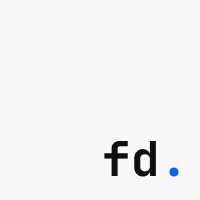

<div align="center">
  
  <h1>F. Diwangkara</h1>
  <p><strong>Digital Portfolio & Project Archive</strong></p>

  <p>
    <a href="https://nuxt.com/"></a>
    <a href="https://vuejs.org/"></a>
    <a href="https://gsap.com/"></a>
  </p>
</div>

---

## ✨ Overview

Welcome to my personal digital portfolio and project archive. This repository holds the source code for a highly interactive, continuous-scrolling web experience designed to showcase my journey as a Junior Developer & Part-time Learner.

## 🚀 Features

- **Continuous Scroll Architecture**: Powered by GSAP ScrollTrigger, the entire site is a seamless scrolling journey—from the hero section through the project showcase, gallery, and contact footer.
- **Dynamic Custom Cursor**: An adaptive cursor that morphs contextually, stretches based on mouse velocity, and reveals interactive labels.
- **Immersive Typography**: Features custom decrypted text effects (`DecryptedText`) and an interactive SVG curved marquee (`CurvedLoop`).
- **Vibrant Liquid UI**: Smooth liquid reveal menus and staggered colorful column loaders.
- **Responsive Design**: Fluid typography and spacing tailored for both desktop precision and mobile accessibility.

## 🛠 Tech Stack

- **Framework**: [Nuxt 3](https://nuxt.com/) & [Vue 3](https://vuejs.org/)
- **Animation**: [GSAP](https://gsap.com/) (GreenSock Animation Platform)
- **Styling**: Vanilla CSS with modern CSS variables, `clamp()`, and custom properties.
- **Assets**: Optimized local images via `@nuxt/image`.

## 📂 Project Structure

```text
├── app/
│   ├── assets/       # Global CSS variables, typography, and base styles
│   ├── components/   # Reusable UI bits, layout sections, and GSAP animations
│   ├── composables/  # Vue composables for GSAP contexts and Cursor tracking
│   └── pages/        # Nuxt file-based routing (Home & Project Details)
├── public/           # Static images, logos, and favicons
└── nuxt.config.ts    # Nuxt framework configuration
```

## 💻 Local Development

1. **Clone the repository**
   ```bash
   git clone https://github.com/fdiwangkara/fdiwangkara.git
   cd fdiwangkara
   ```

2. **Install dependencies**
   ```bash
   npm install
   ```

3. **Start the development server**
   ```bash
   npm run dev
   ```
   The site will be available at `http://localhost:3000`.

## 📬 Contact & Socials

Let's create something awesome together!

- **Email**: [fdiwangkara2412@gmail.com](mailto:fdiwangkara2412@gmail.com)
- **LinkedIn**: [Filemon Diwangkara Bani Saptaji](https://www.linkedin.com/in/filemon-diwangkara-bani-saptaji-21641b297)
- **Instagram**: [@fdiwangkara](https://instagram.com/fdiwangkara)
- **GitHub**: [@fdiwangkara](https://github.com/fdiwangkara)

<br/>

<div align="center">
  <sub>Built with ❤️ by Filemon Diwangkara</sub>
</div>
